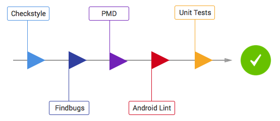

# useRetrofit
使用ViewModel, LiveData, Retrofit , Gson测试TMDb api, 练手练手30分钟写完。

## Code Analysis tools

1. PMD: It finds common programming flaws like unused variables, empty catch blocks, unnecessary object creation, and so forth. See this project's PMD ruleset.
./gradlew pmd

2. Findbugs: This tool uses static analysis to find bugs in Java code. Unlike PMD, it uses compiled Java bytecode instead of source code.
./gradlew findbugs

3. Checkstyle: It ensures that the code style follows our Android code guidelines. See our checkstyle config file.
./gradlew checkstyle

# 项目截图

